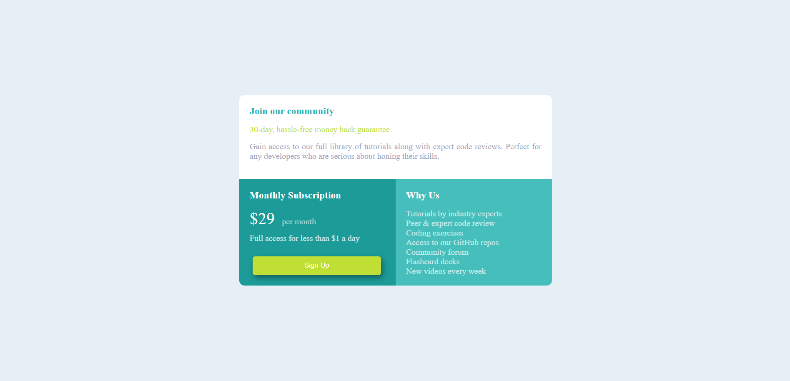

# Frontend Mentor - Single price grid component solution

This is a solution to the [Single price grid component challenge on Frontend Mentor](https://www.frontendmentor.io/challenges/single-price-grid-component-5ce41129d0ff452fec5abbbc). Frontend Mentor challenges help you improve your coding skills by building realistic projects. 

## Table of contents

  - [Project published link](#the-Project-published-link)
  - [The goal](#the-goal)
  - [Screenshot](#screenshot)
  - [Built with](#built-with)
  - [What I learned](#what-i-learned)
  - [Author](#author)

### Project published link: https://ajinkya9834.github.io/Single-Price-Grid--practice/

### The goal

Users should be able to:

- View the optimal layout for the component depending on their device's screen size
- See a hover state on desktop for the Sign Up call-to-action

### Screenshot

-mobile-view:

-desktop-view:

### Built with

- HTML5 markup
- CSS properties
- Flexbox
- CSS Grid
- Mobile-first workflow

### What I learned

- I learned how to used flex, media query and grid to make responsiveness.
- I did Mobile-first workflow.

### Author

- Frontend Mentor (see other challenges done): (https://www.frontendmentor.io/profile/Ajinkya9834)

- My Linkedin profile: www.linkedin.com/in/ajinkya-hajare

